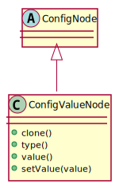
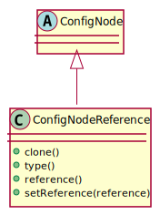
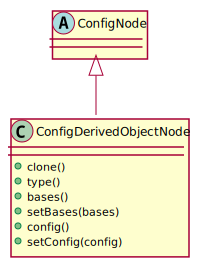

# Design

The design is split into multiple parts:

* Configuration structure
* Reading of configuration files
* Loading of a configuration structure into native C++ types
* Writing the configuration to files


## Configuration structures

The configuration structure shall be container of configuration nodes of the following types:

* Value
* Object
* Node reference
* Derived object

The root of the configuration structure shall be a configuration Object node.

Each configuration node shall provide the following:

* Its clone
* Its configuration node type
* Its parent configuration node (a node without a parent shall be treated as the root node)
* The root configuration node of the configuration structure it is in
* Its location within the configuration structure (*configuration node path*)
* Retrieval of a configuration node from it at the specified configuration node path


### Value node

A configuration value node shall contain only a *configuration parameter value* and not other configuration nodes.

A *configuration parameter value* shall be able to contain any *JSON* data type.




### Object node

A configuration object node shall an associative container storing configuration nodes of any type. Each member of the container shall have a name and a configuration node instance.

It shall provide the standard functionalities for managing the container:

* Getting the number of configuration nodes stored in the container
* Checking if the a configuration node with the specified name is in the container
* Getting the names of all configuration nodes in the container
* Getting the name of the specified configuration node instance
* Getting the configuration node instance with the specified name
* Adding or replacing a configuration node with the specified name
* Removing a configuration node with the specified name from the container
* Removing all configuration nodes from the container

It shall also enable applying one configuration node over another where configuration nodes that have the same name in both container shall be either replaced or applied to the container otherwise they shall be added to the container. A configuration node shall be applied to the container (instead of replaced) only if configuration nodes from both containers are of Object node type.


### Node reference

A configuration node reference shall contain a reference to another configuration node. The reference shall be stored in the *configuration node path* format.




### Derived object node

A configuration derived object node shall contain an optional list of *bases* and *configuration override node*.

The *bases* shall contain references to other configuration nodes of Object type. Each *base* shall be applied in the specified sequence to the *derived object* node starting with na empty object node.

The *configuration override node* shall provide overrides that shall be applied to the resulting base configuration node.




## Reading of configuration files

The configuration files shall be read in the following sequence:


Configuration files shall be read using configuration reader classes that share the functionality for:

* Getting and setting the limit for how many reference resolution cycles are allowed
* Reading of a configuration file
* Reference resolution
* Transformation of configuration data


For reading configuration files of different types the *ConfigReaderRegistry* shall be used. It shall provide:

* Registration of configuration readers to a specific type
* Reading of configuration based on the specified type


### Reading and parsing of a configuration file

A configuration file shall be read and parsed into the *JSON* representation as specified in [requirements](Requirements.md).


### Extraction of environment variables from a configuration file

The environment variables from a configuration file (from ```environment_variables``` member of the configuration file's data structure) shall be added to the environment variable container only if they are not already set.

The environment variables that were already set (from the initial process environment variables or from the configuration files read before this one) shall have priority (they shall not be overridden).


### Extraction of includes from a configuration file

The included configurations (from ```includes``` member of the configuration file's data structure) shall be processed in the same order as they are listed in the configuration file.

Each included configuration shall be have access to current state of the environment variables container and configuration data.

Each processed configuration shall be able to add new environment variables to the environment variables container and/or modify the resulting configuration data.

Note: Each included configuration shall be fully resolved (it shall contain only *Value* and *Object* nodes)!


### Updating of the current directory environment variable

the ```CPPCONFIGFRAMEWORK_CURRENT_DIR``` shall be set to the absolute path of the currently read configuration file.


### Extraction of configuration overrides from a configuration file

The configuration overrides (from ```config``` member of the configuration file's data structure) shall be extracted and all of its references shall be resolved using the current state of the environment variables container and configuration data.

Note: Configuration overrides shall be fully resolved (it shall contain only *Value* and *Object* nodes)!


### Application of configuration overrides

The configuration overrides shall be applied to the configuration data loaded from included configurations (new configuration parameters shall be added and/or existing replaced).


### Transformation of configuration data

The transformation of configuration data shall be done on two levels:

* Source
* Destination

First the *source* transformation shall extract the configuration parameter at the *source node path* from the configuration data. In case of *root node path* no transformation is needed.

Then the *destination* transformation shall move the configuration data to the specified *destination node path* by creating a nested *Object* node structure where the configuration data can be stored.


## Loading of a configuration structure into native C++ types

TODO


## Writing the configuration to files

TODO
