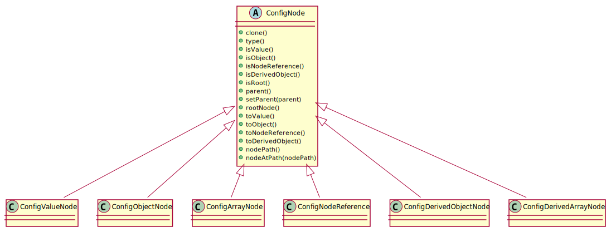
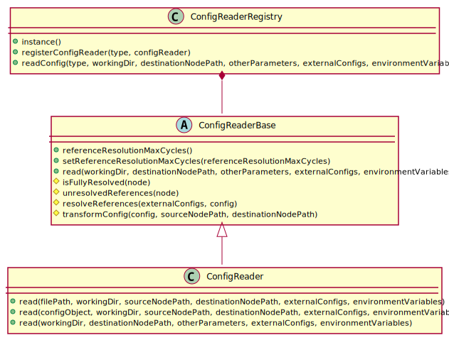

# Design

The design is split into multiple parts:

* Configuration structure
* Reading of configuration files
* Loading of a configuration structure into native C++ types
* Storing of native C++ types into a configuration structure
* Writing the configuration to files


## Configuration structures

The configuration structure shall be container of configuration nodes of the following types:

* Value
* Object
* Array
* Node Reference
* Derived Object
* Derived Array

The root of the configuration structure shall be a configuration Object node.

Each configuration node shall provide the following:

* Its clone
* Its configuration node type
* Its parent configuration node (a node without a parent shall be treated as the root node)
* The root configuration node of the configuration structure it is in
* Its location within the configuration structure (*configuration node path*)
* Retrieval of a configuration node from it at the specified configuration node path




### Value node

A value node shall store one of the following JSON data types:

* null
* Boolean
* Number
* String


### Object node

An object node shall be an associative container storing configuration nodes of any type. Each member of the container shall have a name and a configuration node instance.

It shall provide the standard functionalities for managing the container:

* Getting the number of configuration nodes stored in the container
* Checking if the a configuration node with the specified name is in the container
* Getting the names of all configuration nodes in the container
* Getting the name of the specified configuration node instance
* Getting the configuration node instance with the specified name
* Adding or replacing a configuration node with the specified name
* Removing a configuration node with the specified name from the container
* Removing all configuration nodes from the container

It shall also enable applying one configuration node over another where configuration nodes that have the same name in both container shall be either replaced or applied to the container otherwise they shall be added to the container. A configuration node shall be applied to the container (instead of replaced) only if configuration nodes from both containers are of Object or Array node type.


### Array node

An array node shall be a sequential container storing configuration nodes of any type.

It shall provide the standard functionalities for managing the container:

* Getting the number of configuration nodes stored in the container
* Getting the configuration node instance with the specified index
* Prepending a configuration node to the container
* Inserting a configuration node at the specified index in the container
* Appending a configuration node to the container
* Removing a configuration node with the specified index from the container
* Removing all configuration nodes from the container

It shall also enable applying one configuration node over another where configuration nodes that have the same index in both container shall be either replaced or applied to the container. A configuration node shall be applied to the container (instead of replaced) only if configuration nodes from both containers are of Object or Array node type.


### Node reference

A configuration node reference shall contain a reference to another configuration node. The reference shall be stored in the *configuration node path* format.


### Derived object node

A derived object node shall contain an optional list of *bases* and *configuration override node*.

The *bases* shall contain references to other configuration nodes of Object type. Each *base* shall be applied in the specified sequence to the *derived object* node starting with na empty object node.

The *configuration override node* shall provide overrides that shall be applied to the resulting base configuration node.


### Derived array node

A derived array node shall contain a list of *operations*. Each *operations* shall be an object that defines the operations *type* and it's additional parameters.

The *type* member shall be required and it shall represent the type of operation:

* **prepend_element**: inserts an element at the start of the Array node
* **prepend_elements**: inserts elements at the start of the Array node
* **insert_element**: inserts an element at the specified index of the Array node
* **insert_elements**: inserts elements at the specified index of the Array node
* **append_element**: inserts an element at the end of the Array node
* **append_elements**: inserts elements at the end of the Array node
* **override_element**: overrides an element at the specified index of the Array node
* **override_elements**: overrides elements starting at the specified index of the Array node
* **remove_elements**: removes one or more elements starting at the specified index of the Array node

The *destination_index* member shall point to the index in the resulting Array node where the operation needs to be applied. It shall be available and required for operations:

* *insert_element*
* *insert_elements*
* *override_element*
* *override_elements*
* *remove_elements*

The *base* member shall contain a reference to the configuration parameter node to use as a base. In case the *type* represents insertion or overriding of elements then the referenced configuration parameter node shall also be an Array node. It shall be available and optional for insertion and overriding operations.

The *source_index* member shall point to the index in the Array node from *base* where the operation needs to be applied. It shall be available and optional (default value: "0") for operations:

* *prepend_elements*
* *insert_elements*
* *append_elements*
* *override_elements*

The *count* member shall be optional and a positive non-zero integer. It shall be available for the removal operation with the default value "1" and for insertion and overriding operations where the default value shall match the number of elements from Array node from *base* from it's *source_index* to the end of the Array node.

The *config* member shall enable the user to override the configuration parameters for that operation. In case the *type* represents insertion or overriding of elements then the *config* member shall be a *JSON Array*. It shall be available and optional for insertion and overriding operations.

The configuration parameter node the *base* node and the *config* member shall be merged together with *base* node being applied first and the *config* node last. In case of Array nodes the element with the same index will be merged with the resulting Array node having the same number or elements as the larger of the two Array nodes.

The following table defines the available commands (columns) and their additional parameters (rows) where each cell defines if the parameter is required, optional (value in ```[]``` represents the default value), or if it is not supported (blank cell):

|                       | **prepend_element** |  **prepend_elements**  | **insert_element** |   **insert_elements**  | **append_element** |   **append_elements**  | **override_element** |  **override_elements** | **remove_elements** |
|-----------------------|:-------------------:|:----------------------:|:------------------:|:----------------------:|:------------------:|:----------------------:|:--------------------:|:----------------------:|:-------------------:|
| **destination_index** |                     |                        |      required      |        required        |                    |                        |       required       |        required        |       required      |
| **base**              |       optional      |        optional        |      optional      |        optional        |      optional      |        optional        |       optional       |        optional        |                     |
| **source_index**      |                     |      optional [0]      |                    |      optional [0]      |                    |      optional [0]      |                      |      optional [0]      |                     |
| **count**             |                     | optional [len(source)] |                    | optional [len(source)] |                    | optional [len(source)] |                      | optional [len(source)] |     optional [1]    |
| **config**            |       optional      |        optional        |      optional      |        optional        |      optional      |        optional        |       optional       |        optional        |                     |


## Reading of configuration files

The configuration files shall be read in the following sequence:


Configuration files shall be read using configuration reader classes that share the functionality for:

* Getting and setting the limit for how many reference resolution cycles are allowed
* Reading of a configuration file
* Reference resolution
* Transformation of configuration data



For reading configuration files of different types the *ConfigReaderRegistry* shall be used. It shall provide:

* Registration of configuration readers to a specific type
* Reading of configuration based on the specified type


### Reading and parsing of a configuration file

A configuration file shall be read and parsed into the *JSON* representation as specified in [requirements](Requirements.md).


### Extraction of environment variables from a configuration file

The environment variables from a configuration file (from ```environment_variables``` member of the configuration file's data structure) shall be added to the environment variable container only if they are not already set.

The environment variables that were already set (from the initial process environment variables or from the configuration files read before this one) shall have priority (they shall not be overridden).


### Extraction of includes from a configuration file

The included configurations (from ```includes``` member of the configuration file's data structure) shall be processed in the same order as they are listed in the configuration file.

Each included configuration shall be have access to current state of the environment variables container and configuration data.

Each processed configuration shall be able to add new environment variables to the environment variables container and/or modify the resulting configuration data.

Note: Each included configuration shall be fully resolved (it shall contain only *Value*, *Object*, and *Array* nodes)!


### Updating of the current directory environment variable

The ```CPPCONFIGFRAMEWORK_CURRENT_DIR``` shall be set to the absolute path of the currently read configuration file.


### Extraction of configuration overrides from a configuration file

The configuration overrides (from ```config``` member of the configuration file's data structure) shall be extracted and all of its references shall be resolved using the current state of the environment variables container and configuration data.

Note: Configuration overrides shall be fully resolved (it shall contain only *Value*, *Object*, and *Array* nodes)!


### Application of configuration overrides

The configuration overrides shall be applied to the configuration data loaded from included configurations (new configuration parameters shall be added and/or existing replaced).


### Transformation of configuration data

The transformation of configuration data shall be done on two levels:

* Source
* Destination

First the *source* transformation shall extract the configuration parameter at the *source node path* from the configuration data. In case of *root node path* no transformation is needed.

Then the *destination* transformation shall move the configuration data to the specified *destination node path* by creating a nested *Object* node structure where the configuration data can be stored.


## Loading of a configuration structure into native C++ types

It shall be possible to load a configuration structure from:

* A configuration object node
* A member of a configuration object node
* A node at a specific path of a configuration object node

It shall also be possible to load an optional configuration structure from:

* A member of a configuration object node
* A node at a specific path of a configuration object node

Note: the *loaded* flag shall be set only if the (optional) configuration's node is actually loaded.


TODO: ConfigItem instead of ConfigLoader!
TODO: update API of ConfigItem


When a configuration structure is loaded it shall first load the configuration parameters and then execute the validation of the loaded parameters. If at any point an error occurs the error handler shall be invoked and loading terminated.


A configuration structure shall be required to implement the ```loadConfigParameters()``` method where it shall load its individual configuration parameters with the help of the provided methods for loading od required and optional configuration parameters.

Note: if a configuration parameter is derived from the ```ConfigLoader``` class then it shall be necessary to load it using its ```loadConfig()``` method (or one of the other helper methods). But if a configuration parameter is a container of items derived from the ```ConfigLoader``` class then the ```loadRequiredConfigContainer()``` or ```loadOptionalConfigContainer()``` method shall be used.


## Storing of native C++ types into a configuration structure

TODO: document


## Writing the configuration to files

It shall be possible to convert a configuration *Object* node to *JSON* in the *C++ Config Framework* format. With this functionality it shall be possible to store a configuration node to a file so that it can be read with *ConfigReader*.

It shall also be possible to convert a fully resolved configuration *Object* node to an ordinary *JSON value* (without the *C++ Config Framework* format specifics).
